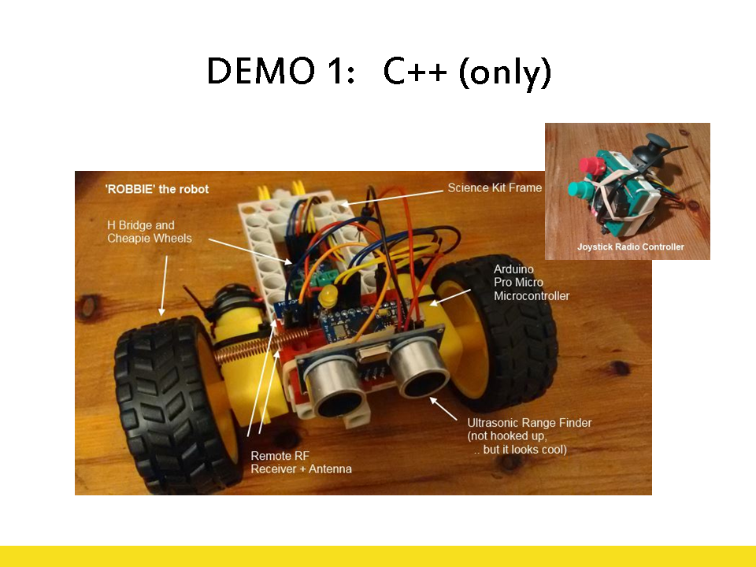

This demo uses the following components:

For the Robot:

- [5V 16MHz Arduino Pro Micro](https://www.sparkfun.com/products/12640) 
- [Radio Receiver Module](http://www.ebay.com/itm/Mini-RF-Transmitter-Receiver-Module-Wireless-Link-Kit-Antennas-for-Arduino-/132012986957)
- [5V motorised wheels](http://www.ebay.com/itm/2pcs-Smart-Car-Robot-Plastic-Tire-Wheel-With-DC-3-6v-Gear-Motor-For-Arduino-/222366070168) 
- [H-Bridge module](http://www.ebay.com/itm/2x-H-bridge-Stepper-Motor-Controller-Dual-Board-HG7881-Driver-Module-For-Arduino-/272169655955)
- [Ultrasonic Rangefinder module](http://www.ebay.com/itm/5PCS-Ultrasonic-Sensor-Module-HC-SR04-Distance-Measuring-Sensor-for-arduino-SR04-/170897438205)

For the Remote control

- [5V 16MHz Arduino Pro Micro](https://www.sparkfun.com/products/12640) 
- [Radio Transmitter Module](http://www.ebay.com/itm/433MHZ-Transmitter-Module-SYN115-ASK-Wireless-Module-/201551034505)
- [Joystick Module](http://www.ebay.com/itm/1pc-JoyStick-Breakout-Module-Shield-For-PS2-Joystick-Game-Controller-Arduino-/172271501564)
