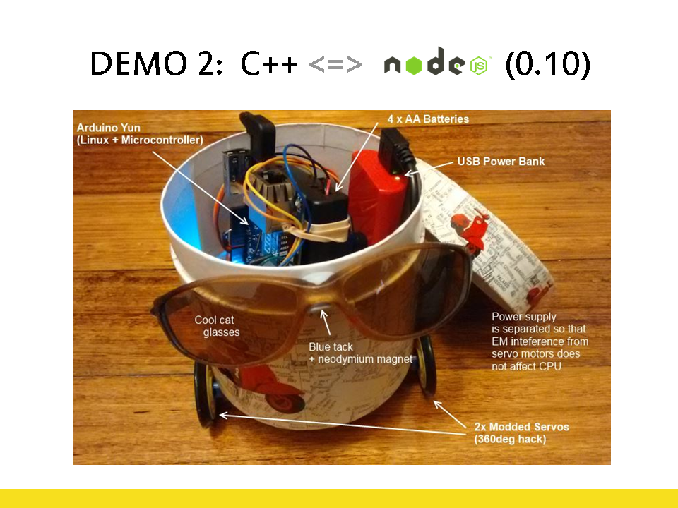

Parts used for this robot:

- [Arduino Yun](https://www.arduino.cc/en/Main/ArduinoBoardYun)
- [2x Servo Motors](http://www.ebay.com.au/itm/1PCS-NEW-For-RC-Robot-2016-Helicopter-Airplane-Car-Boat-9G-SG90-Micro-Servo-/162164661006?hash=item25c1c45b0e:g:8WQAAOSwZVlXqu7I) with [360 Continuous Rotation Hack](https://www.youtube.com/watch?v=pJbcEydxeiM)
- [Radio Receiver Module](http://www.ebay.com/itm/Mini-RF-Transmitter-Receiver-Module-Wireless-Link-Kit-Antennas-for-Arduino-/132012986957)
- [Switched AA Battery Holder](http://www.ebay.com.au/itm/Battery-Cover-Box-Plastic-Holder-with-ON-OFF-Switch-for-4-x-AA-Batteries-BU-/262648606548)
- [5V USB Power bank](http://www.ebay.com.au/itm/Sony-USB-Portable-Charger-Power-Bank-Lithium-Polymer-5000mAh-Black-/272163510709)
